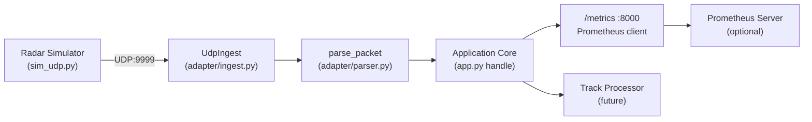

# High Level System Diagram
               +---------------------------+
               |  Radar Simulator (UDP)    |
               |  sends JSON track/health  |
               +-------------+-------------+
                             | UDP :9999
                             v
+----------------------------+----------------------------+
|        Ingest Adapter (UdpIngest)                       |
|  - asyncio.DatagramProtocol                             |
|  - Receives raw datagrams                               |
|  - Calls parse_packet -> Parsed(kind,payload)           |
+----------------------------+----------------------------+
                             |
                             | Python object callback
                             v
+---------------------------------------------------------+
|                Application Core (app.py)                |
|  - handle(parsed)                                       |
|  - Updates Prometheus Gauges/Counters                   |
|  - Logs track / health / frame events                   |
+---------+---------------------------+--------------------+
          |                           |
          |                           | HTTP :8000 (/metrics)
          v                           v
+------------------+        +------------------------------+
| Track Processor  |        | Prometheus Client Server     |
| (future module)  |        | Exposes metrics in text fmt  |
|  - Filtering     |        | Consumed by Prometheus (opt) |
|  - Smoothing     |        +---------------+--------------+
|  - Association   |                        |
+------------------+                        | Scrape (HTTP)
                                            v
                                   +------------------+
                                   | Prometheus Server |
                                   | (optional)        |
                                   +------------------+

# Mermaid flowchart

# Components and Files
| Component                   | File(s)                               | Responsibility                                              | Key Interfaces                                  |
|----------------------------|----------------------------------------|-------------------------------------------------------------|--------------------------------------------------|
| Simulator                  | `src/tools/sim_udp.py`                 | Generate synthetic radar Track & Health messages            | UDP → `(host, port)`                             |
| Ingest Adapter             | `src/adapter/ingest.py`                | Non‑blocking datagram receive; creates parse tasks          | `asyncio.DatagramProtocol.datagram_received`     |
| Parser                     | `src/adapter/parser.py`                | Convert raw JSON bytes → `Parsed(kind, payload)`            | `parse_packet(bytes) -> Parsed`                  |
| Application Core           | `src/app.py`                           | Handle parsed objects, update metrics, log                  | Callback: `handle(Parsed)`                       |
| Models                     | `src/common/models.py`                 | Validate domain objects (`Track`, `HealthStatus`) (Pydantic)| Instantiation from JSON dict                     |
| Metrics Endpoint           | `prometheus_client.start_http_server`  | Serve Prometheus text exposition at `/metrics`              | HTTP GET `/metrics`                              |
| Prometheus Server (optional) | external                             | Scrape metrics from app                                     | Pull: HTTP GET `/metrics`                        |
| Future Track Processor     | (planned)                              | Smoothing, association, filtering                           | API / function calls / queue                     |

# Planned Enhancements
## Multi-sensor data fusion
- Add `src/processor` module for track processing
- Add multiple radar sensors
- Add EO/IR sensor
- Extended Kalman Filter (EKF) for data fusion

## Dashboard
- Add `src/dashboard` for FastAPI + simple HTML/JS frontend

## Containerize
- Add Docker files
- Update readme to explain how to run in Docker

## Test
- Update `radar/test` folder with `pytest` coverage

## CI/CD Pipeline
- Run `pytest` on every code commit

## Deploy on Ubuntu VM
- create `radar/deployment` folder
- Install and configure components
- Document step-by-step setup procedure in `deployment/ubuntu_install.md`
- Create install scripts (`setup.sh`)

## Network configuration  
- Set up separate VLANs (management, data, C2)
- Configure firewall rules (iptables/ufw)
- Implement NTP time sync (critical for track timestamps)
- Enable TLS for HTTP endpoints

## System hardening
- Disable unused services
- Configure log rotation & centralized logging
- Set up fail2ban or intrusion detection
- Document security posture in `deployment/security_checklist.md`

## Monitoring and Alerting
- Grafana dashboards for system health
- PagerDuty/email alerts for failures
- Log aggregation (ELK stack or Grafana Loki)